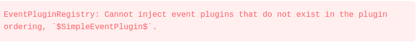

# Google Closure Compiler

## A Compiler by Google for taking JavaScript source and optimizing it for deployment to the web

!SLIDE

# Java jar available through

	@@@bash
	npm install google-closure-compiler

# Webpack and gulp tooling through

	@@@bash
	npm install google-closure-compiler-js

!SLIDE

## Run it from the command line by

    @@@bash
    java -jar closure-compiler.jar --js foo.js --js_output_file bar.js

!SLIDE

## Commands can be written to "flag files"

    @@@bash
    --js foo.js
    --jsoutput_file bar.js

 

    @@@bash
    java -jar closure-compiler.jar --flagfile flagfile.conf

!SLIDE

# Debug flags
* Turns off variable name mangling making for more readable compiled output
* Pretty prints compiled output

 

    @@@bash
    java -jar closure-compiler.jar --debug --formatting PRETTY_PRINT --flagfile flagfile.conf

!SLIDE

# Extended Demo Compiling a TypeScript + React Hello World App

    @@@jsx
	import * as React from 'react';
	import * as ReactDOM from 'react-dom';

	class TodoApp extends React.Component<{}, {}> {
	  public render () {
		return (
		  
Hello World!

		);
	  }
	}

	function render() {
	  ReactDOM.render(
		<TodoApp/>,
		document.getElementById('app')
	  );
	}

	render();

!SLIDE

# 01 - Try the simplest thing possible

	@@@bash
	--compilation_level=ADVANCED_OPTIMIZATIONS
	--language_out=ES5

	--js_output_file=dist/bundle.js
	--js src/build-react/**.js

!SLIDE

## Google Closure Compiler was created around 2009 before Common JS and ECMAScript 6 modules

	@@@bash
	src/build-react/app.js:2: ERROR - variable exports is undeclared
	Object.defineProperty(exports, "__esModule", { value: true });
						  ^^^^^^^

	src/build-react/app.js:3:
	Originally at:
	src/react/app.tsx:1: ERROR - variable require is undeclared
	import * as React from 'react';
	^^^^^^^

!SLIDE

# Google Closure's Module system

	@@@javascript
	/** Declare a namespace */
	goog.provide("some.namespace");

	/** Pull in code from another file */
	goog.require("a.required.namespace")

!SLIDE

# 02 - Use CommonJS Module

	@@@bash
	--process_common_js_modules

!SLIDE

## Google Closure default to using the browser's resolution algorithm

	@@@bash
	src/build-react/app.js:3:
	Originally at:
	src/react/app.tsx:1: WARNING - Invalid module path "react" for resolution mode "BROWSER"
	import * as React from 'react';
	^

	src/build-react/app.js:3:
	Originally at:
	src/react/app.tsx:1: WARNING - Invalid module path "react" for resolution mode "BROWSER"
	import * as React from 'react';
	^

!SLIDE

# 03 - Use Node Resolution Algorithm

	@@@bash
	--module_resolution=NODE

!SLIDE

## Google Closure doesn't look in `node_modules` for dependencies

	@@@bash
	src/build-react/app.js:3:
	Originally at:
	src/react/app.tsx:1: WARNING - Failed to load module "react"
	import * as React from 'react';
	^

	src/build-react/app.js:4:
	Originally at:
	src/react/app.tsx:2: WARNING - Failed to load module "react-dom"
	import * as ReactDOM from 'react-dom';
	^

!SLIDE

# 04 - Add React and ReactDOM dependencies

	@@@bash
	--js node_modules/react-dom/package.json
	--js node_modules/react-dom/**.js

	--js node_modules/react/package.json
	--js node_modules/react/**.js

!SLIDE

# Adding the `package.json` gives Google Closure the libraries metadata (e.g. where the main file is located)

!SLIDE

## We need to add React and ReactDOM's dependencies

	@@@bash
	node_modules/react-dom/cjs/react-dom-server.browser.development.js:17: WARNING - Failed to load module "object-assign"
	var objectAssign$1 = require('object-assign');
						 ^

	node_modules/react-dom/cjs/react-dom-server.browser.development.js:18: WARNING - Failed to load module "fbjs/lib/invariant"
	var invariant = require('fbjs/lib/invariant');
		^

	node_modules/react-dom/cjs/react-dom-server.browser.development.js:22: WARNING - Failed to load module "prop-types"
	var propTypes = require('prop-types');
		^

	node_modules/react-dom/cjs/react-dom-server.node.development.js:28: WARNING - Failed to load module "stream"
	var stream = require('stream');
		^

!SLIDE

# 05 - Add React and ReactDOM's dependencies

	@@@bash
	--js node_modules/react/package.json
	--js node_modules/react/**.js

	--js node_modules/fbjs/package.json
	--js node_modules/fbjs/lib/**.js

	--js node_modules/object-assign/package.json
	--js node_modules/object-assign/**.js

	--js node_modules/prop-types/package.json
	--js node_modules/prop-types/**.js

!SLIDE

# We'll need to do this for all NPM librarues :(
## There are tools to automate finding dependencies
* madge: https://github.com/pahen/madge
* module-deps: https://github.com/browserify/module-deps

!SLIDE

# Or Google Closure Compiler!

	@@@bash
	-compilation_level=WHITESPACE_ONLY
	--language_out=ES5
	--rewrite_polyfills false

	--dependency_mode=STRICT
	--module_resolution=NODE
	--process_common_js_modules
	--jscomp_off=checkVars

	--output_manifest=react.MF

	--js node_modules/**.json
	--js node_modules/**.js
	--js !node_modules/fbjs/flow/**.js

	--entry_point=./node_modules/react/index.js
	--entry_point=./node_modules/react-dom/index.js

!SLIDE

# `module.exports` is declared twice
## Google Closure throws an error by default when variables are declared more than once

	@@@bash
	node_modules/react/index.js:4: ERROR - Variable module$node_modules$react$index declared more than once. First occurrence: node_modules/react/index.js
	  module.exports = require('./cjs/react.production.min.js');
	  ^^^^^^^^^^^^^^

	node_modules/react/index.js:6: ERROR - Variable module$node_modules$react$index declared more than once. First occurrence: node_modules/react/index.js
	  module.exports = require('./cjs/react.development.js');
	  ^^^^^^^^^^^^^^

!SLIDE

# 06 - Ignore Duplicate Variable Declaration
## `jscomp_off` turns off a Google Closure warning or error

	@@@bash
	--jscomp_off=checkVars
!SLIDE

# First milestone finished
## Compilation with no errors!

!SLIDE

# 07 - Compiler Debugging information

	@@@bash
	--output_manifest=dist/manifest.MF
	--property_renaming_report=dist/property_renaming_report
	--variable_renaming_report=dist/variable_renaming_report

!SLIDE

# `output_manifest`
## Records all the files used during compilation and the order they were fed into the compiler

!SLIDE

# `property_renaming_report`
## Shows how Google transforms object properties

	@@@javascript
	var foo = {bar: 1};
	var baz = 4;

 
## Report

	@@@bash
	bar:$bar$

 

	@@@javascript
	var foo$bar$ = 1;
	var baz = 4;

!SLIDE

# `variable_renaming_report`
## Shows how Google mangles names

	@@@javascript
	var foo = {bar: 1};
	var baz = 4;

 
## Report

	@@@bash
	foo$bar$:a
	baz:b

 

	@@@javascript
	var a = 1;
	var b = 4;

!SLIDE

# Together these reports give us many details on how the Google Closure Compiler is working internally

!SLIDE

# 08 - Dependency Management Optimization

	@@@bash
	--dependency_mode=STRICT

	--entry_point=./src/build-react/app

!SLIDE

# Output Manifest shows 140+ files
## Many of those files are not needed for the final compilation

!SLIDE

# `entry_point`
## Entry JavaScript file, Google Closure compiler can resolve the dependencies of these files

!SLIDE

# `dependency_mode`
## `STRICT` only use the entry point files and their dependencies

!SLIDE

# Benefits
* Using 140+ files to around 30
* 12 second compile time to about 8 seconds
* Debugged non gzip size 2.8 mb to 1.1 mb

!SLIDE

# We run our Hello World App and get

## In the compiled JavaScript

	@@@javascript
	"production" !== process.$env$.$NODE_ENV$

!SLIDE

# Looking at React index file

	@@@javascript
	if (/** Defined by compiler */ process.env.NODE_ENV === 'production') {
	  module.exports = require('./cjs/react.production.min.js'); //Production React
	} else {
	  module.exports = require('./cjs/react.development.js');    //Development React
	}

# We want this

	@@@javascript
	process.env.NODE_ENV = 'production'; //Set by compiler

	if (/** process.env.NODE_ENV */ 'production' === 'production') {
	  module.exports = require('./cjs/react.production.min.js'); //Production React
	} else {
	  module.exports = require('./cjs/react.development.js');    //Development React
	}

!SLIDE

# 09 - Closure Defines

## Typescript `properties.ts`

	@@@typescript
	var goog: any = goog || {};
	goog.provide('process.env');
	/** @define {string} */
	goog.define("process.env.NODE_ENV", "development");

## Flag file

	@@@bash
	--define="process.env.NODE_ENV='production'"
    --entry_point=goog:process.env

!SLIDE

# `goog.define`
## Marks JavaScript variable to be replaced
## Assigns default values to JavaScript variables during compilation

	@@@javascript
	goog.provide('process.env');
	/** @define {string} */
	goog.define('process.env.NODE_ENV', 'development');

## Equivalent to

	@@@javascript
	var process = {};
	process.env = {};
	process.env.NODE_ENV = 'development';

!SLIDE

# `/** @define {type} */`
## Metadata needed for `goog.define`

!SLIDE

## Not in a Google Closure Namespace

	@@@javascript
	/** @define {number} */
	goog.define('bendy.data.circularBuffer.SIZE', 10);

## In an incorrect Google Closure namespace

	@@@javascript
	goog.provide('foo.bar');
	/** @define {number} */
	goog.define('bendy.data.circularBuffer.SIZE', 10);

## Object's namespace is in Google Closure namespace

	@@@javascript
	goog.provide('bendy.data.circularBuffer');
	/** @define {number} */
	goog.define('bendy.data.circularBuffer.SIZE', 10);

!SLIDE

# `define`
## Overrides the default value of a defined variable

## Default value `"development"`

	@@@javascript
	goog.define('process.env.NODE_ENV', 'development');

## Compiled value `"production"`

	@@@bash
	--define="process.env.NODE_ENV='production'"

!SLIDE

## Entry file with a `goog.provide`

	@@@javascript
	goog.provide('process.env');

## Entry point `goo:<Google Closure namespace>`

	@@@bash
    --entry_point=goog:process.env

!SLIDE

# New runtime error

## Facebook translated message

!SLIDE

## We run into an error at `injectEventPluginsByName` in ReactDOM

!SLIDE

## Event plugins keys are set

	@@@javascript
	var DOMEventPluginOrder = [
	  'ResponderEventPlugin',
	  'SimpleEventPlugin',
	  'TapEventPlugin',
	  'EnterLeaveEventPlugin',
	  'ChangeEventPlugin',
	  'SelectEventPlugin',
	  'BeforeInputEventPlugin',
	];

 

	@@@javascript
	/**
	 * Inject modules for resolving DOM hierarchy and plugin ordering.
	 */
	EventPluginHub.injection.injectEventPluginOrder(DOMEventPluginOrder);

!SLIDE

## ReactDOM installs default plugins

	@@@javascript
	/**
	 * Some important event plugins included by default (without having to require
	 * them).
	 */
	EventPluginHub.injection.injectEventPluginsByName({
	  SimpleEventPlugin: SimpleEventPlugin,
	  EnterLeaveEventPlugin: EnterLeaveEventPlugin,
	  ChangeEventPlugin: ChangeEventPlugin,
	  SelectEventPlugin: SelectEventPlugin,
	  BeforeInputEventPlugin: BeforeInputEventPlugin,
	});

!SLIDE

# Looking at property renaming

	@@@bash
	SimpleEventPlugin:$SimpleEventPlugin$

## Google Closure Compiler translation

	@@@javascript
	EventPluginHub.injection.injectEventPluginsByName({
	  $SimpleEventPlugin$: SimpleEventPlugin
	});
	/** "SimpleEventPlugin" !== $SimpleEventPlugin$  */

!SLIDE

# 10 - Add React and ReactDOM externs

	@@@bash
	--externs ./src/externs/react.ext.js
	--externs ./src/externs/react-dom.ext.js

!SLIDE

## Externs tell Google Closure What names to leave alone during compilation

	@@@javascript
	/**
	 * @type {!Object}
	 * @const
	 * @suppress {const|duplicate}
	 */
	var React = {};

	/**
	 * @type {string}
	 * @const
	 */
	React.version;

	React.createClass = function(specification) {};
	React.createFactory = function(reactClass) {};

!SLIDE

# Additional metadata (e.g. types or pure functions) can help Google Closure

!SLIDE

# Everything works!
## Compile time now has no errors
## Hello World App runs correctly

!SLIDE

# Now lets add runtime debugging tooling

!SLIDE

# 11 - Source Maps

	@@@bash
	--create_source_map=%outname%.map
	--output_wrapper="%output%//# sourceMappingURL=bundle.js.map"

!SLIDE

# `create_source_map`
## Creates source map with name specified. `%outname%` is replaced with the name of the complied Javascript file

!SLIDE

# `output_wrapper`
## Adds text before or after the file marked by `%output%`

!SLIDE

## When we check our source maps `node_modules` and our TypeScript files are under the directory where our complied JavaScript is located

!SLIDE

# Translate web paths to file system paths for Google Closure

!SLIDE

# 12 - Web path to File path translation

	@@@bash
	--source_map_location_mapping node_modules|../node_modules
	--source_map_location_mapping src|../src

!SLIDE

# `source_map_location_mapping`
## Translate web path to file system path `<web path>|<file system path>`

!SLIDE

# What's left?
## Splitting out single complied JavaScript into multiple modules (bundles)

!SLIDE

# 13 - Code Splitting Modules

	@@@bash
	--module_output_path_prefix ./dist/

	--module common:143
	--module main:2:common

# Remove

	@@@bash
	--output_wrapper="%output%//# sourceMappingURL=bundle.js.map"

# Move to bottom

	@@@bash
	--js src/build-react/**.js

!SLIDE

# `module_output_path_prefix`
## specifies prefixes a path to modules

	@@@bash
	--module_output_path_prefix ./dist
	--module common:143
	// ./distcommon.js

	@@@bash
	--module_output_path_prefix ./dist/
	--module common:143
	// ./dist/common.js

!SLIDE

	@@@bash
	--js ./library/sound.js
	--js ./library/size.js

	--js ./animal/mammal/cat.js
	--js ./animal/mammal/dog.js
	--js ./animal/mammal/cow.js

	--js ./animal/bird/robin.js

	--js ./animal/reptile/iguana.js
	--js ./animal/reptile/alligator.js

	--module common:2          //Files: sound, size       [1, 2]
	--module mammal:3:common   //Files: cat, dog, cow     [3, 4, 5]
	--module bird:1:common     //Files: robin             [6]
	--module reptile:2:common  //Files: iguana, alligator [7, 8]

!SLIDE

# `module`
## Defines a module by giving the name, number of files and dependencies

	@@@bash
	<module name>:<number of JavaScript files>:<dependency>, <dependency>

!SLIDE

# Final file sizes
* `common.js` - 5.9K
* `main.js` - 84K

##  Wait `common.js` had React and ReactDOm along with all there dependencies!

!SLIDE

# Cross Module Code Motion

!SLIDE

# We lost our Source maps
## The output manifest should be for each module

!SLIDE

# 14 - Add debugging details back

	@@@bash
	--output_manifest=%outname%.MF
	--module_wrapper="common:%s//# sourceMappingURL=%basename%.map"
	--module_wrapper="main:%s//# sourceMappingURL=%basename%.map"

!SLIDE

## `%outname%` on `output_manifest` gives an output manifest for each module with it's name

	@@@bash
	common.MF
	main.MF

!SLIDE

# `module_wrapper`
## Same as `output_wrapper` only for modules
* `%s` - Modules JavaScript
* `%basename%` - Modules name (e.g. common or main

 

	@@@bash
	<module name>:wrapper

!SLIDE

# Al Done!
## Well there is only more optimization

!SLIDE

# 15 - Remove ES6 polyfills

	@@@bash
	--rewrite_polyfills false

!SLIDE

# By default Google Closure injects ployfills for ES6 functionality
* Previous `common.js` 5.9K
* No polyfill `common.js` 842

!SLIDE

# We've got an optimal TypeScript and React Hello World App

